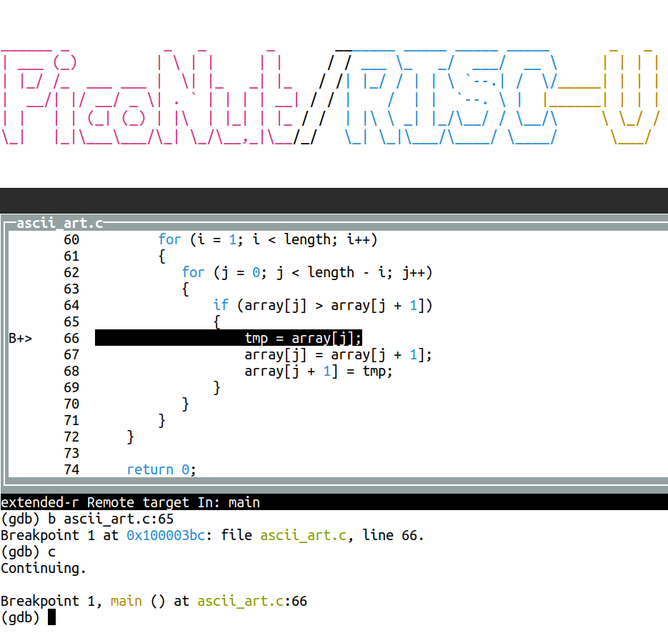

# PicoNut

[-passing-804228?style=flat-square&logo=Github%20Actions&labelColor=162F38)](https://ees.tha.de/piconut/manual/contributor_resources/riscof.html)

The PicoNut project at the Technical University of Applied Sciences Augsburg
provides a minimal and at the same time flexibly expandable RISC-V system for
educational purposes. Its main features are the use of SystemC as its modelling
language, a new concept of Soft Hardware to enable efficient simulations and
emulations and the support for open-source tools and open-source FPGA boards.
The processor is intended to be used in teaching and research, in order to
examine different computer architectures, the interaction between hardware and
operating systems (Linux, FreeRTOS) and the integration of hardware accelerators,
for example for AI applications.

PicoNut …

* … is a minimal, yet extendable RISC-V processor as an open source project.

* … runs on inexpensive FPGA boards, e.g. OrangeCrab or ULX3S.

* … is expandable with memory protection/MMU (Linux), AI acceleration, various RISC-V extensions.

* The hardware is modeled in SystemC (C++) in order to be able to build a powerful simulator from the same source code.

* Good software support is provided by RISC-V compatibility: GNU toolchain (GCC/GDB), newlib, FreeRTOS, Linux.

* Solid project management includes automated testing, project website and CI/CD techniques.

The project started at the beginning of 2024 and currently involves several enthusiastic students who are working on project work or theses. 

More information about the project can be found on the [PicoNut Project Website](https://ees.tha.de/piconut/index_en.html).

# Getting started

Instructions on how to set up the project and create the first simulation or run the PicoNut on the ULX3S FPGA Board can be found in the Chapter [Getting Started](https://ees.tha.de/piconut/manual/getting-started.html) in the projects documentation.

# Manual

The manual of the project can be found [here](https://ees.tha.de/piconut/manual/index.html).

# License

See [LICENSE](LICENCE) or license notes in the respective directories / files.
